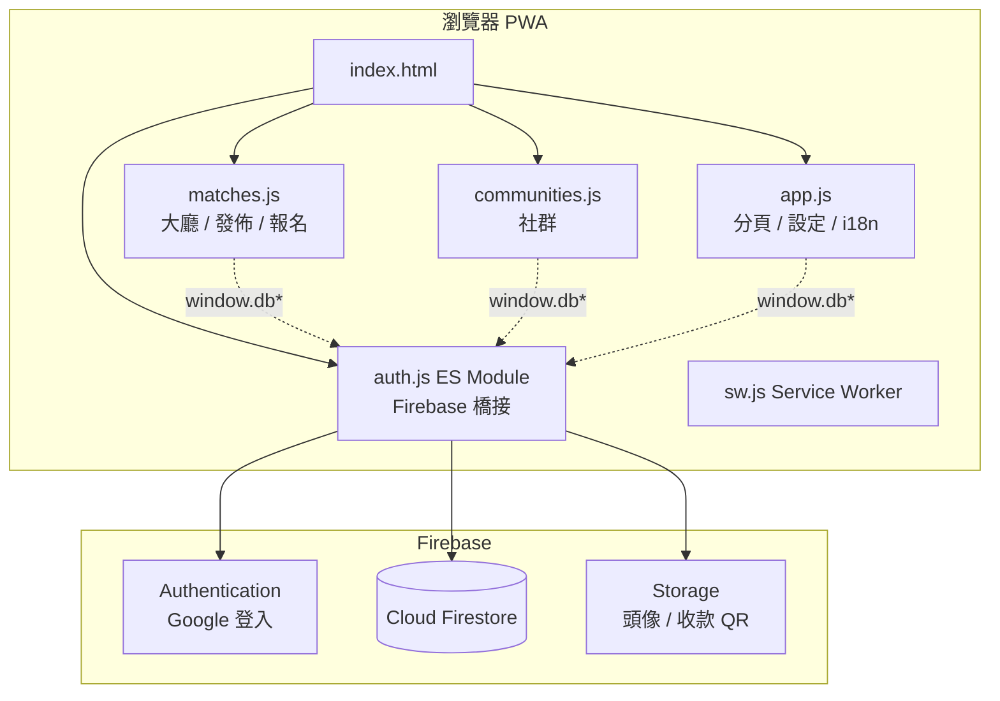
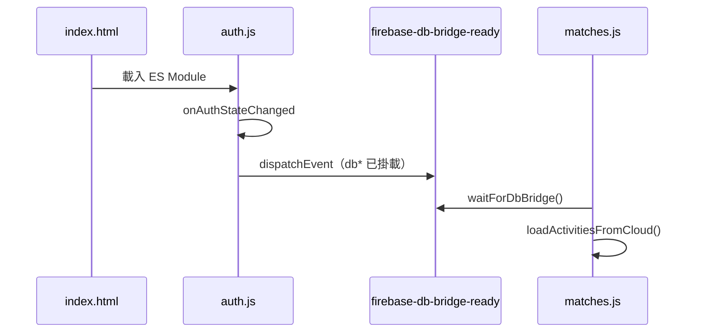
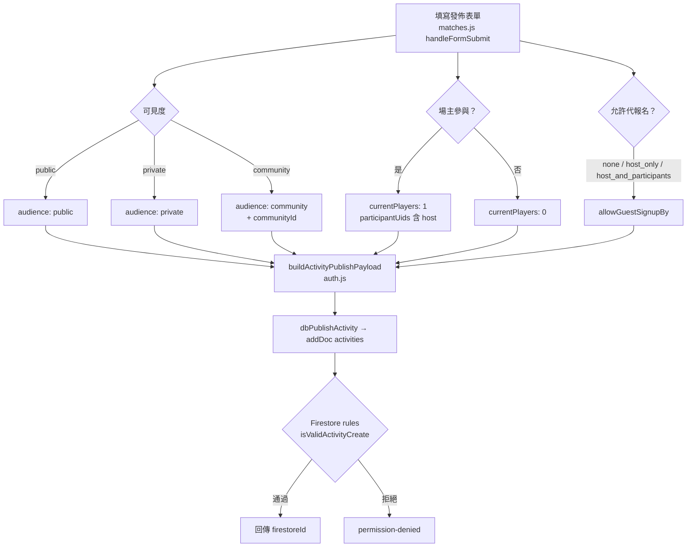
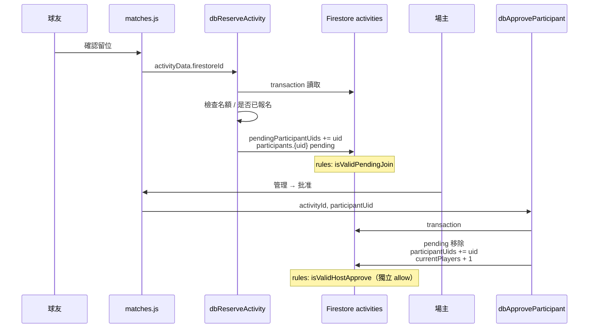
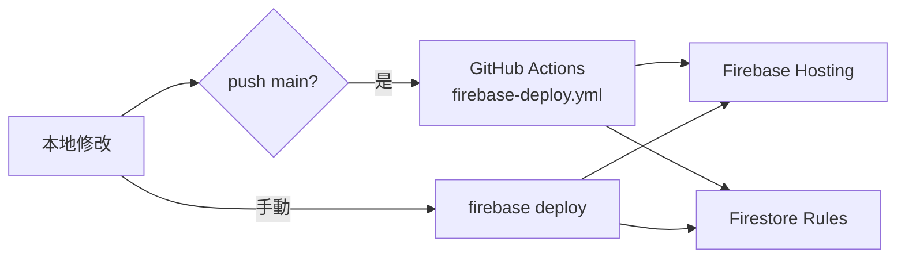

# +1 API 與資料流程

接手同事用：前端模組分工、Firestore 橋接 API、主要業務流程圖。

**相關文件：** [產品規格](./product-spec.md) · [測試清單](./testing-checklist.md) · [UI 規格](./design-spec.md)

**目前版本：** v1.33.2 · Firebase 專案 `badminton-app-b08cc`

---

## 一、架構總覽



### 模組職責

| 檔案 | 職責 | 呼叫 Firebase？ |
|------|------|----------------|
| `js/auth.js` | 登入狀態、`window.db*` API、Firestore transaction | ✅ 唯一直接存取層 |
| `js/matches.js` | 大廳渲染、發佈表單、報名 UI、場主管理 | 透過 `window.db*` |
| `js/communities.js` | 社群列表、詳情、搜尋邀請 | 透過 `window.db*` |
| `js/app.js` | 分頁切換、設定、個人資料 UI | 透過 `window.db*` |
| `firestore.rules` | 伺服器端授權（與 `db*` 寫入路徑對齊） | — |

### 初始化順序



> `matches.js` / `communities.js` 在呼叫任何 `window.db*` 前應先 `waitForDbBridge()`，避免 module 尚未就緒。

---

## 二、Firestore 橋接 API 一覽

所有 API 定義於 `js/auth.js`，掛在 `window` 上供一般 script 呼叫。

### 場次（activities）

| API | 用途 | 主要寫入集合 |
|-----|------|--------------|
| `dbPublishActivity(data)` | 發佈場次 | `activities` create |
| `dbDeleteActivity(id)` | 場主刪除場次 | `activities` delete |
| `dbFetchActivities()` | 大廳列表（`playDate >= 今天`） | `activities` read |
| `dbFetchActivityById(id)` | 單場讀取 | `activities` read |
| `dbReserveActivity(data)` | 報名留位（待審） | `activities` update |
| `dbJoinWaitlist(data)` | 後補 | `activities` update |
| `dbCancelReservation(data)` | 取消報名／待審 | `activities` update |
| `dbApproveParticipant(id, uid)` | 場主批准 | `activities` update（transaction） |
| `dbRejectParticipant(id, uid)` | 場主拒絕 | `activities` update（transaction） |
| `dbAddGuestParticipant(id, payload)` | 代報名 | `activities` update（transaction） |
| `dbRemoveGuestParticipant(id, guestId)` | 移除代報 | `activities` update（transaction） |
| `dbFetchMyHostedActivities(n)` | 我發佈的 | `activities` query |
| `dbFetchMyJoinedActivities(n)` | 我參加的 | `activities` query |
| `dbCountHostDuplicateActivities(criteria)` | 重複場次檢查 | `activities` query |

### 社群（communities）

| API | 用途 |
|-----|------|
| `dbCreateCommunity(payload)` | 建立社群 + owner member |
| `dbListMyCommunities()` | 我的社群索引 |
| `dbFetchCommunityById(id)` | 社群詳情 |
| `dbFetchCommunityMembers(id)` | 成員列表 |
| `dbFetchCommunityActivities(id)` | 社群場次 |
| `dbJoinCommunity(id)` | 加入（含邀請連結） |
| `dbLeaveCommunity(id)` | 離開 |
| `dbKickCommunityMember(id, uid)` | 建立者踢人 |
| `dbDeleteCommunity(id)` | 刪除社群 |

### 搜尋邀請（userDirectory）

| API | 用途 |
|-----|------|
| `dbGetUserDirectoryOptIn()` | 讀取 opt-in |
| `dbSetUserDirectoryOptIn(bool)` | 開關可被搜尋 + 同步 `userDirectory` |
| `dbSearchUserDirectory(query)` | 字首搜尋 |
| `dbSendCommunityInvite(communityId, targetUid)` | 發送邀請 |
| `dbListMyCommunityInvites()` | 我的待處理邀請 |
| `dbAcceptCommunityInvite(id)` | 接受 |
| `dbDeclineCommunityInvite(id)` | 拒絕 |

### 用戶與場主設定

| API | 用途 |
|-----|------|
| `dbUpdateUserProfile(name, file)` | 名字 + 頭像 |
| `dbFetchHostPaymentSettings(uid)` | 收款 QR / FPS |
| `dbUploadHostPaymentQr(type, file)` | 上傳 QR |
| `dbSaveHostFpsId(fpsId)` | FPS 號碼 |
| `dbSubmitFeedback(payload)` | 意見回饋 |
| `dbDeleteUserAccount()` | 注銷帳號 |

---

## 三、核心流程圖

### 3.1 發佈場次



**規則要點：** `create` 僅允許欄位白名單；起始人數為 0 或「場主自報 1 人」；社群場次需 `isCommunityMember`。

---

### 3.2 報名 → 批准



**拒絕流程：** `dbRejectParticipant` → 自 `pendingParticipantUids` 移除 + `deleteField` on `participants.{uid}`（`isValidHostReject`）。

---

### 3.3 社群限定場次報名

```mermaid
flowchart LR
  A[球友打開社群頁] --> B[dbFetchCommunityActivities]
  B --> C[顯示 communityId 場次]
  C --> D[確認留位]
  D --> E[assertUserCanJoinCommunityActivity]
  E --> F{members/{uid} 存在？}
  F -->|是| G[dbReserveActivity]
  F -->|否| H[activity/community-only 錯誤]
  G --> I[rules: isValidPendingJoin<br/>+ 社群成員檢查]
```

大廳 `dbFetchActivities` **不會**撈到 `audience: community` 場次。

---

### 3.4 代報名（Guest）

```mermaid
flowchart TD
  A[場主或已批准參加者] --> B{allowGuestSignupBy}
  B -->|host_only| C[僅 hostUid]
  B -->|host_and_participants| D[host 或 participantUids 含本人]
  C & D --> E[dbAddGuestParticipant]
  E --> F[transaction]
  F --> G[guestParticipants.{id} 新增<br/>currentPlayers + 1]
  G --> H[rules: isValidGuestAdd]
```

移除：`dbRemoveGuestParticipant` → 場主可刪任意 guest；參加者僅能刪 `addedByUid === 自己`。

---

### 3.5 社群加入與搜尋邀請

```mermaid
flowchart TB
  subgraph link [邀請連結]
    L1["URL ?community=ID"] --> L2[登入後 dbJoinCommunity]
    L2 --> L3[members/{uid} + communityMemberships]
  end

  subgraph search [搜尋邀請]
    S1[建立者搜尋] --> S2[dbSearchUserDirectory]
    S2 --> S3[userDirectory 字首查詢]
    S3 --> S4[dbSendCommunityInvite]
    S4 --> S5[users/{target}/communityInvites]
    S5 --> S6[對方接受 dbAcceptCommunityInvite]
    S6 --> L2
  end
```

**搜尋前提：** 被邀請者在設定開啟 `directoryOptIn` → 寫入 `userDirectory/{uid}`。

---

## 四、深連結與 URL 參數

| 參數 | 範例 | 行為 |
|------|------|------|
| `invite` | `?invite={activityId}` | 開啟私人／指定場次報名 |
| `community` | `?community={communityId}` | 登入後嘗試加入社群 |

處理位置：`matches.js`（invite）、`communities.js`（community）。

---

## 五、Firestore 規則與客戶端對齊

`activities` 的 `update` 使用**多條獨立** `allow`（勿合併成單一 OR 鏈，避免評估錯誤連帶拒絕）：

| allow 路徑 | 對應客戶端 API |
|------------|----------------|
| `isValidHostReject` | `dbRejectParticipant` |
| `isValidHostApprove` | `dbApproveParticipant` |
| `isValidPendingJoin` | `dbReserveActivity` |
| `isValidWaitlistJoin` | `dbJoinWaitlist` |
| `isValidCancelApproved` / `isValidCancelPending` | `dbCancelReservation` |
| `isValidGuestAdd` / `isValidGuestRemove` | `dbAddGuestParticipant` / `dbRemoveGuestParticipant` |

修改 `firestore.rules` 後**必須** deploy：

```bash
npx firebase-tools deploy --only firestore:rules --project badminton-app-b08cc
```

---

## 六、常見錯誤碼

| code | 常見原因 |
|------|----------|
| `permission-denied` | 規則未 deploy、欄位不符、非場主／非成員 |
| `activity/full` | 名額已滿 |
| `activity/community-only` | 非社群成員報名社群場次 |
| `community-invite/not-searchable` | 對方未開啟可被搜尋邀請 |
| `auth/not-signed-in` | 未登入 |
| `activity/not-pending` | 批准／拒絕時不在待審名單 |

前端多在 `matches.js` / `communities.js` 以 `err?.code` 對應 i18n alert。

---

## 七、部署資料流



- **Hosting**：`js/`、`index.html`、`css/` → 用戶需重載 PWA（`sw.js` cache 遞增）
- **Rules**：與 Hosting 獨立；只改前端不會更新規則

---

*最後更新：2026-06-04 · v1.33.2*
